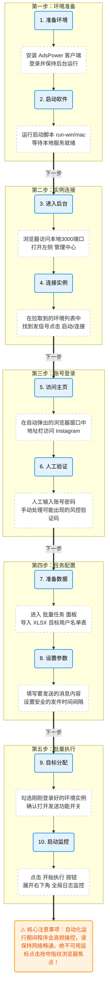

```mermaid
flowchart TD
    %% 样式定义
    classDef step fill:#e3f2fd,stroke:#2196f3,stroke-width:2px,color:#000;
    classDef action fill:#fff,stroke:#b0bec5,stroke-width:1px,stroke-dasharray: 5 5,color:#333;
    classDef warn fill:#fff3e0,stroke:#ff9800,stroke-width:2px,color:#e65100;

    subgraph P1 [第一步：环境准备]
        direction LR
        S1("1. 准备环境"):::step --> A1("安装 AdsPower 客户端<br/>登录并保持后台运行"):::action
        A1 --> S2("2. 启动软件"):::step
        S2 --> A2("运行启动脚本 run-win/mac<br/>等待本地服务就绪"):::action
    end

    subgraph P2 [第二步：实例连接]
        direction RL
        S3("3. 进入后台"):::step --> A3("浏览器访问本地3000端口<br/>打开左侧 管理中心"):::action
        A3 --> S4("4. 连接实例"):::step
        S4 --> A4("在拉取到的环境列表中<br/>找到发信号点击 启动/连接"):::action
    end

    subgraph P3 [第三步：账号登录]
        direction LR
        S5("5. 访问主页"):::step --> A5("在自动弹出的浏览器窗口中<br/>地址栏访问 Instagram"):::action
        A5 --> S6("6. 人工验证"):::step
        S6 --> A6("人工输入账号密码<br/>手动处理可能出现的风控验证码"):::action
    end

    subgraph P4 [第四步：任务配置]
        direction RL
        S7("7. 准备数据"):::step --> A7("进入 批量任务 面板<br/>导入 XLSX 目标用户名单表"):::action
        A7 --> S8("8. 设置参数"):::step
        S8 --> A8("填写要发送的消息内容<br/>设置安全的发件时间间隔"):::action
    end

    subgraph P5 [第五步：批量执行]
        direction LR
        S9("9. 目标分配"):::step --> A9("勾选刚刚登录好的环境实例<br/>确认打开发送功能开关"):::action
        A9 --> S10("10. 启动监控"):::step
        S10 --> A10("点击 开始执行 按钮<br/>展开右下角 全局日志监控"):::action
    end

    %% 阶段之间的连接（S型蜿蜒走线）
    A2 ==>|下一步| S3
    A4 ==>|下一步| S5
    A6 ==>|下一步| S7
    A8 ==>|下一步| S9

    %% 警告节点
    Alert("⚠️ 核心注意事项：自动化运行期间程序会高频操控，请保持网络畅通，绝不可用鼠标点击抢夺指纹浏览器焦点！"):::warn
    A10 ==> Alert
```
